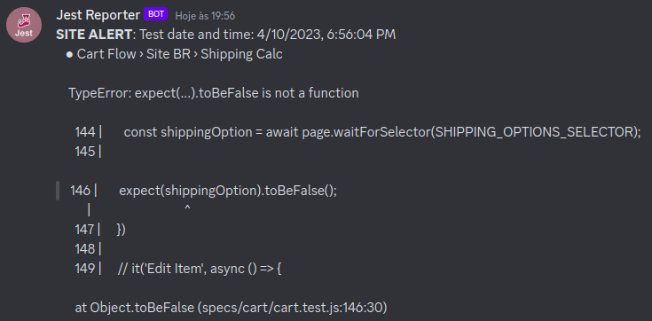

<div align="center">
  
  <p>A virtual bridge to see your Jest test error reports on your Discord server!</p>
</div>

## Install

```sh
npm install --save-dev jest-discord-bridge
# or
yarn add -D jest-discord-bridge
```

## Usage

You must configure the jest config. Do not forget `webhook` from your discord channel.

```javascript
module.exports = {
    ...
    reporters: [
    'default',
    ['jest-discord-reporter', {
      userName: 'Jest Reporter', //optional, default is 'Jest Reporter'
      avatarUrl: 'https://jestjs.io/pt-BR/img/opengraph.png', // optional, default is jest logo
      webhook: 'https://discordapp.com/api/webhooks/YOUR-WEBHOOK-KEY', //required
      timeZone: 'America/New_York', //optional, default is 'America/New_York'; timeZone list: https://gist.github.com/diogocapela/12c6617fc87607d11fd62d2a4f42b02a, 
      reportIfSuccess: true, // optional, default is false;
    }],
  ],
    ...
}
```

## Result

